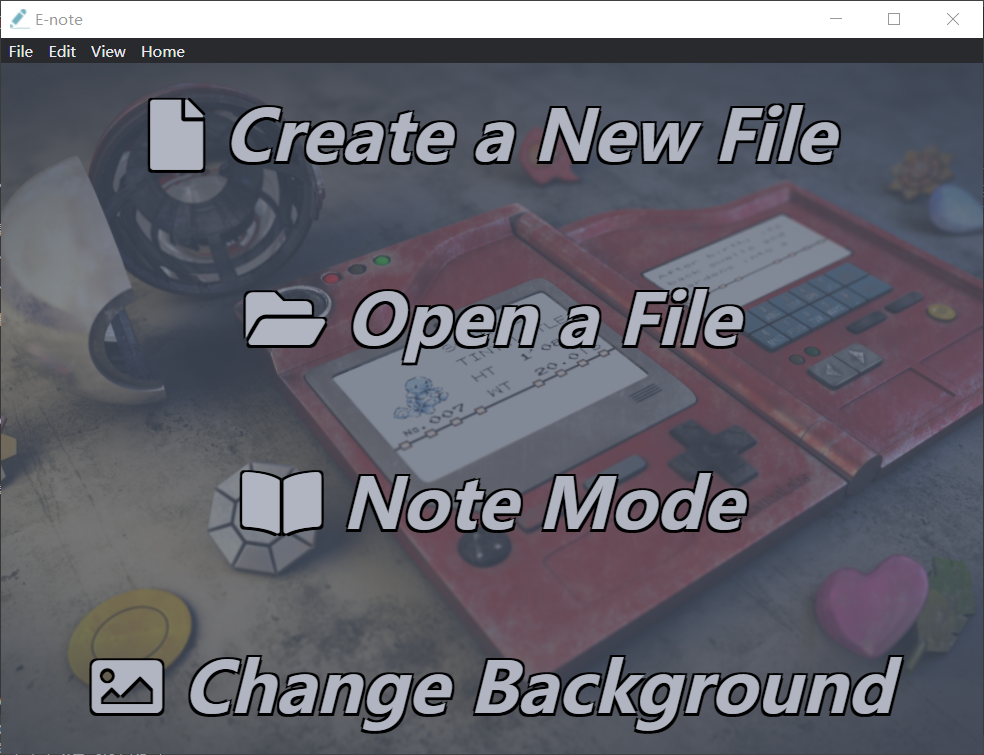

#  E-note 
An electron and nodejs based note app for Windows.

一款基于 electron 和 nodejs 的便签应用。
#
## Main features | 主要特性
* Built with Electron | 使用 Electron 构建
* Change background | 更换背景图片
* Note Mode | 笔记模式
    * Fixed on the top | 固定在顶层
* Screenshot function | 截图功能
    * Resize and move | 缩放和移动
    * Window recognition | 窗口识别  

    * Fixed on the desktop | 钉在桌面上  

    * Copy the rgb | 复制rgb色值
* Paste and view larger image | 查看大图  

* Search function | 搜索功能  

Development
---
#### Project's folders
- `src` - code of your application goes here.
    - `css`
    - `dll` - win32API to do the window recognization
    - `extra`
    - `fontawesome` - https://fontawesome.com
    - `image` - the ico for app
    - `js` - some modules
    - `preload`
    - `render`
- `build` - in this folder lands built, runnable application.
#### build
In administrator mode run `electron-builder build` to generate installation package  
在管理员模式下使用 `electron-builder build` 来生成安装包

Cooperate
---
#### Email me

### License

MIT License